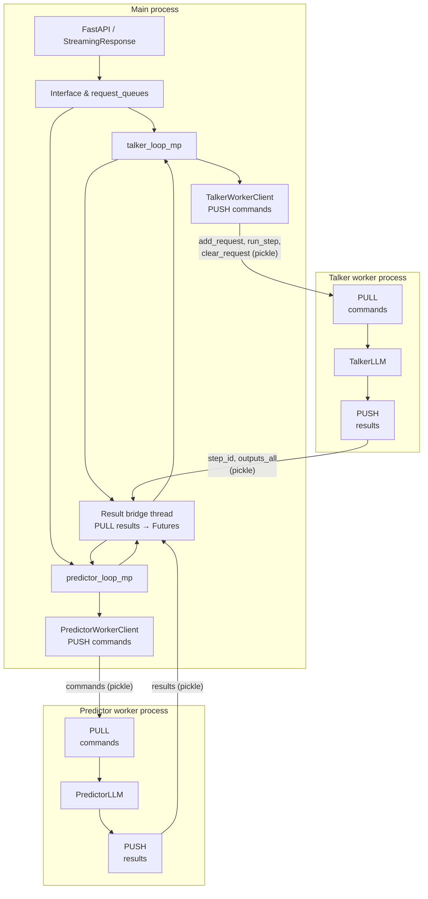

# nano-qwen3tts-vllm

Qwen3-TTS with nano vLLM-style optimizations for fast text-to-speech generation.

## Author note
This project was born after I tested the Qwen3-TTS model and realized the RTF (Real-Time Factor) remained stubbornly high, even on an H100. It sparked an idea: could we create a **"nano-vllm" moment** for Qwen3TTS? My goal is to match the efficiency of vLLM implementation within a concise, ~1k line codebase.

I am building this while diving deep into both the [nano-vllm](https://github.com/GeeeekExplorer/nano-vllm) and [Qwen3TTS](https://github.com/QwenLM/Qwen3-TTS) source code. I anticipate some hurdles along the way and would appreciate any insights or feedback from the community.

Optimization for the Qwen3-TTS model will continue in the [vllm-omni](https://github.com/vllm-project/vllm-omni) repo—stay tuned for updates!

## Highlights
> [!IMPORTANT]
> 🎉 **Breakthrough:** 8 concurrent audio streams can now run at near real-time speed on H100 for 1.7B model with new refactor now, enabling true parallel multi-user TTS service!

### Performance Optimizations
- **Continuous Batching** — Batches multiple sequences and schedules prefill/decode across them for higher throughput.
- **Page Attention** — Paged KV cache with block tables and slot mapping for efficient memory use and variable-length sequences.
- **CUDA Graph** — Predictor and speech decoder use captured CUDA graphs (multiple batch sizes / decode lengths) to reduce kernel launch overhead.
- **Streaming Support** — Async generation with ZMQ: stream codec chunks as they are produced; API returns PCM audio stream (e.g. `POST /v1/audio/speech` with `StreamingResponse`).

## Architecture (multiprocess + ZMQ)

When using multiprocess engines (`USE_MULTIPROCESS_ENGINES=1` or the default server setup), the main process runs the API and orchestration; the talker and predictor models run in separate worker processes. Communication is over **ZeroMQ (ZMQ)** TCP sockets: main **PUSH**es commands and **PULL**s results; a **result-bridge thread** turns worker replies into asyncio Future completions so engine loops can dispatch to per-request queues.



- **Commands** (main → workers): serialized with `workers/protocol.py` (pickle + numpy); e.g. `add_request`, `run_step`, `clear_request`, `shutdown`.
- **Results** (workers → main): worker PUSHes to main’s PULL sockets; the result-bridge thread completes the corresponding asyncio Future; engine loops then push `(engine_type, msg_type, payload)` into `request_queues[request_id]` for the API to consume.

## Benchmark Results

### Performance Comparison (Voice Design Model)

Tested on NVIDIA H100 with `Qwen/Qwen3-TTS-12Hz-1.7B-VoiceDesign` with script `examples/quick_benchmark.py`:
| Metric | nano-vllm | Original Qwen3-TTS | Improvement |
|--------|-----------|-------------------|-------------|
| **Avg Generation Time** | 2.612s | 8.487s | **3.25x faster** |
| **Real-Time Factor (RTF)** | 0.399 | 1.467 | **3.68x better** |


Tested on NVIDIA L4 with `Qwen/Qwen3-TTS-12Hz-1.7B-VoiceDesign` with script `examples/quick_benchmark.py`:
| Metric | nano-vllm | Original Qwen3-TTS | Improvement |
|--------|-----------|-------------------|-------------|
| **Avg Generation Time** | 4.319s | 16.613s | **3.85x faster** |
| **Real-Time Factor (RTF)** | 0.742 | 3.311 | **4.46x better** |


**Key Findings:**
- 🚀 **4.86x faster** generation speed
- 📊 **RTF < 0.4** means nano-vllm generates audio **2.8x faster than real-time**
- ⚡ Original implementation has RTF ~2.0 (slower than real-time)
- 💪 Consistent performance across different text lengths

### Streaming Performance (Custom Voice Model)

L4 GPU, 0.6B custom model, decode wav each 1 chunk

| Setup | First chunk latency (16 codec codes) | Inner chunk latency | RTF |
|------|--------------------------------------|---------------------|-----|
| **1 CCU** | 160 ms | 50 ms | 0.65 |
| **2 CCUs** | 250 ms | 90 ms | 1.125 |

*(CCU = concurrent request / “concurrent chunk unit” in the setup.)*

### Feature Completeness
- ✅ **All Model Types Supported** — CustomVoice (pre-defined   speakers), VoiceDesign (text-to-voice), and Base (voice cloning)
- ✅ **Voice Cloning** — ICL mode and x_vector_only mode for reference audio-based voice cloning
- ✅ **Voice Design** — Generate voices from natural language descriptions
- ✅ **Streaming Generation** — Generator-based API for codec chunk streaming
- ✅ **Multi-language** — English, Chinese, and auto-detection support

## Installation

**Requirements**

- Python ≥3.10
- PyTorch ≥2.10 with CUDA
- **Compute capability ≥8.0** (e.g. Ampere/Ada) for Flash Attention
- `qwen-tts`, `transformers`, and other deps below

**Flash Attention (recommended)**

For a fast install without building from source, use pre-built wheels:

```bash
# Example: Python 3.12, CUDA 12.4, PyTorch 2.5
pip install https://github.com/mjun0812/flash-attention-prebuild-wheels/releases/download/v0.0.0/flash_attn-2.6.3+cu124torch2.5-cp312-cp312-linux_x86_64.whl
```

Pick the wheel that matches your Python, CUDA, and PyTorch from:  
[https://github.com/mjun0812/flash-attention-prebuild-wheels](https://github.com/mjun0812/flash-attention-prebuild-wheels)

**Project**

```bash
git clone https://github.com/hawkhai/nano-qwen3tts-vllm.git
cd nano-qwen3tts-vllm
uv sync
# or
pip install -e .

# flash-attn 难装，不是它“设计复杂”，而是它强绑定 GPU + CUDA + PyTorch + 编译链版本，任何一个不一致就直接炸。
# Python 3.11（OK）
deactivate
rm -rf .venv
python3 -m venv .venv
source .venv/bin/activate

pip install torch==2.5.0 torchvision==0.20.0 torchaudio==2.5.0 \
  --index-url https://download.pytorch.org/whl/cu121
  
# 2.5.0 12.1
python -c "import torch; print(torch.__version__, torch.version.cuda)"

pip install -U pip setuptools wheel packaging ninja --index-url https://mirrors.aliyun.com/pypi/simple/

pip install ninja setuptools wheel packaging cmake --index-url https://mirrors.aliyun.com/pypi/simple/
pip install flash-attn==2.6.3 --no-build-isolation -v
pip uninstall flash-attn -y
pip install flash-attn==2.5.8 --no-build-isolation -v --index-url https://mirrors.aliyun.com/pypi/simple/
pip install flash_attn-2.6.3+cu121torch2.5-cp311-linux_x86_64.whl

python -c "import flash_attn; print('flash-attn OK')"
pip install vllm

# 2. 如果还是 11.5，让我们下载并安装 CUDA 12.1
wget https://developer.download.nvidia.com/compute/cuda/12.1.1/local_installers/cuda_12.1.1_530.30.02_linux.run
# 3. 安装 CUDA 12.1 (只安装工具包)
sudo TMPDIR=/data/tmp_cuda sh cuda_12.1.1_530.30.02_linux.run --silent --toolkit

sudo rm -rf /usr/local/cuda
sudo rm -rf /usr/local/cuda-13.0
sudo ln -s /usr/local/cuda-12.1 /usr/local/cuda

export CUDA_HOME=/usr/local/cuda
export PATH=$CUDA_HOME/bin:$PATH
export LD_LIBRARY_PATH=$CUDA_HOME/lib64:$LD_LIBRARY_PATH

which nvcc
nvcc -V


nvcc -V
python -c "import torch; print(torch.__version__, torch.version.cuda)"
which nvcc

python examples/custom_voice_example.py --model-path Qwen/Qwen3-TTS-12Hz-1.7B-CustomVoice --text "Hello world" --speaker Vivian


deactivate
rm -rf .venv
python3 -m venv .venv
source .venv/bin/activate

pip install torch torchvision torchaudio \
  --index-url https://download.pytorch.org/whl/cu121 \
  --extra-index-url https://mirrors.aliyun.com/pypi/simple/

python -c "import torch; print(torch.cuda.is_available())"
pip install -U pip setuptools wheel packaging ninja psutil --index-url https://mirrors.aliyun.com/pypi/simple/
pip install flash-attn==2.8.3 --no-build-isolation --index-url https://mirrors.aliyun.com/pypi/simple/


# 全新尝试 Python 3.12, CUDA 12.4, PyTorch 2.5
pip install uv --index-url https://mirrors.aliyun.com/pypi/simple/
cd /data/nano-qwen3tts-vllm
export UV_CACHE_DIR=/data/uvcache/.cache/uv

uv python install 3.12
uv python pin 3.12

uv venv --python 3.12
source .venv/bin/activate

uv pip install torch==2.5.0 torchvision==0.20.0 torchaudio==2.5.0 \
  --index-url https://download.pytorch.org/whl/cu121 \
  --extra-index-url https://mirrors.aliyun.com/pypi/simple/

uv pip install setuptools wheel ninja packaging --index-url https://mirrors.aliyun.com/pypi/simple/

# Example: Python 3.12, CUDA 12.4, PyTorch 2.5
uv pip install flash-attn==2.6.3 --no-build-isolation --index-url https://mirrors.aliyun.com/pypi/simple/

# 1. 创建符号链接让 flash-attn 找到 nvcc
sudo mkdir -p /usr/local/cuda/bin
sudo ln -sf /usr/lib/nvidia-cuda-toolkit/bin/nvcc /usr/local/cuda/bin/nvcc
sudo ln -sf /usr/lib/nvidia-cuda-toolkit/lib64 /usr/local/cuda/lib64

# 2. 设置 CUDA_HOME
export CUDA_HOME=/usr/local/cuda
export PATH=$CUDA_HOME/bin:$PATH
export LD_LIBRARY_PATH=$CUDA_HOME/lib64:$LD_LIBRARY_PATH

# 3. 验证 nvcc 位置
which nvcc
ls -la /usr/local/cuda/bin/nvcc

# 4. 尝试安装 flash-attn
uv pip install flash-attn==2.6.3 --no-build-isolation --index-url https://mirrors.aliyun.com/pypi/simple/

# 5. 如果还是失败，直接测试 TTS
uv run python examples/custom_voice_example.py --model-path Qwen/Qwen3-TTS-12Hz-1.7B-CustomVoice --text "Hello world" --speaker Vivian


# 1. 检查当前 nvcc 版本
nvcc -V

# 2. 如果还是 11.5，让我们下载并安装 CUDA 12.1
wget https://developer.download.nvidia.com/compute/cuda/12.1.1/local_installers/cuda_12.1.1_530.30.02_linux.run


# 3. 安装 CUDA 12.1 (只安装工具包)
sudo TMPDIR=/data/tmp_cuda sh cuda_12.1.1_530.30.02_linux.run --silent --toolkit

# 4. 更新环境变量
export CUDA_HOME=/usr/local/cuda-12.1
export PATH=$CUDA_HOME/bin:$PATH
export LD_LIBRARY_PATH=$CUDA_HOME/lib64:$LD_LIBRARY_PATH

# 5. 验证新版本
$CUDA_HOME/bin/nvcc --version

# 6. 安装 flash-attn
uv pip install flash-attn --no-build-isolation --prefer-binary --index-url https://mirrors.aliyun.com/pypi/simple/


# 1. 检查系统信息
uname -m
cat /etc/os-release | grep VERSION_ID

# 3. 安装 CUDA 12.1 (只安装工具包，不安装驱动)
sudo TMPDIR=/data/tmp_cuda sh cuda_12.1.1_530.30.02_linux.run --silent --toolkit
sudo rm -rf /tmp/*
mkdir -p /data/tmp_cuda
sudo TMPDIR=/data/tmp_cuda sh cuda_12.1.1_530.30.02_linux.run --silent --toolkit


# 4. 设置环境变量
export CUDA_HOME=/usr/local/cuda-12.1
export PATH=$CUDA_HOME/bin:$PATH
export LD_LIBRARY_PATH=$CUDA_HOME/lib64:$LD_LIBRARY_PATH

# 5. 验证安装
$CUDA_HOME/bin/nvcc --version

# 6. 安装 flash-attn
uv pip install flash-attn==2.6.3 --no-build-isolation --index-url https://mirrors.aliyun.com/pypi/simple/

# 7. 验证 flash-attn
python -c "import flash_attn; print(f'Flash Attention: {flash_attn.__version__}')"


uv run python examples/custom_voice_example.py --model-path Qwen/Qwen3-TTS-12Hz-1.7B-CustomVoice --text "Hello world" --speaker Vivian

# 1. 卸载当前 PyTorch
uv pip uninstall torch torchaudio

# 2. 安装 PyTorch 2.4.0（可能与 flash-attn wheel 更兼容）
uv pip install torch==2.4.0 torchaudio==2.4.0 \
  --index-url https://download.pytorch.org/whl/cu121 \
  --extra-index-url https://mirrors.aliyun.com/pypi/simple/

# 3. 验证 PyTorch 版本
python -c "import torch; print(f'PyTorch: {torch.__version__}'); print(f'CUDA: {torch.version.cuda}')"

# 4. 重新安装 flash-attn
uv pip install /data/explore/mytts/qwen/flash_attn-2.6.3+cu121torch2.4-cp312-cp312-linux_x86_64.whl

# 5. 验证 flash-attn
python -c "import flash_attn; print(f'Flash Attention: {flash_attn.__version__}')"

# 6. 测试 TTS
uv run python examples/custom_voice_example.py --model-path Qwen/Qwen3-TTS-12Hz-1.7B-CustomVoice --text "Hello world" --speaker Vivian

------

# 1. 卸载当前版本
uv pip uninstall torch torchaudio

# 2. 安装 PyTorch 2.5.0 with CUDA 12.4
uv pip install torch==2.5.0 torchaudio==2.5.0 \
  --index-url https://download.pytorch.org/whl/cu121 \
  --extra-index-url https://mirrors.aliyun.com/pypi/simple/

# 3. 验证 CUDA 版本
python -c "import torch; print(f'PyTorch: {torch.__version__}'); print(f'CUDA: {torch.version.cuda}')"

# 4. 安装对应的 flash-attn (PyTorch 2.5 + CUDA 12.4)
uv pip install /data/explore/mytts/qwen/flash_attn-2.6.3+cu121torch2.5-cp312-cp312-linux_x86_64.whl

# 5. 验证 flash-attn
python -c "import flash_attn; print(f'Flash Attention: {flash_attn.__version__}')"

# 6. 测试 TTS
uv run python examples/custom_voice_example.py --model-path Qwen/Qwen3-TTS-12Hz-1.7B-CustomVoice --text "Hello world" --speaker Vivian

## 尝试编译这玩意。
# 1. 卸载当前的 flash-attn
uv pip uninstall flash-attn

# 2. 安装构建依赖
uv pip install setuptools wheel ninja packaging --index-url https://mirrors.aliyun.com/pypi/simple/

# 3. 验证编译环境
python -c "import torch; print(f'PyTorch: {torch.__version__}'); print(f'CUDA: {torch.version.cuda}'); print(f'GPU available: {torch.cuda.is_available()}')"


# 卸载当前 PyTorch
uv pip uninstall torch torchaudio

# 重新安装 PyTorch 2.5.0 with CUDA 12.4
uv pip install torch==2.5.0 torchaudio==2.5.0 \
  --index-url https://download.pytorch.org/whl/cu121 \
  --extra-index-url https://mirrors.aliyun.com/pypi/simple/

# 验证版本
python -c "import torch; print(f'PyTorch: {torch.__version__}'); print(f'CUDA: {torch.version.cuda}')"


# 检查 CUDA 是否在系统路径中
echo $PATH
find /usr -name nvcc 2>/dev/null
find /opt -name nvcc 2>/dev/null

# 检查 PyTorch 是否能找到 CUDA 编译器
python -c "import torch; print(torch.cuda.cudnn_version()); print(torch.cuda.version())"


# 检查 CUDA 编译器位置
echo $PATH
find /usr -name nvcc 2>/dev/null
find /opt -name nvcc 2>/dev/null
find /usr/local -name nvcc 2>/dev/null

# 检查 NVIDIA 驱动和 CUDA 运行时
nvidia-smi
python -c "import torch; print(f'CUDA available: {torch.cuda.is_available()}'); print(f'CUDA version: {torch.version.cuda}'); print(f'cuDNN version: {torch.backends.cudnn.version()}')"


# 检查必要的编译工具
which gcc
gcc --version
which nvcc
nvcc --version


# 1. 检查系统包管理器
which apt-get

# 2. 更新包列表
sudo apt-get update

# 3. 安装 CUDA 工具包 (12.4 版本)
sudo apt-get install nvidia-cuda-toolkit

# 4. 设置 CUDA_HOME 环境变量
export CUDA_HOME=/usr/local/cuda
export PATH=$CUDA_HOME/bin:$PATH
export LD_LIBRARY_PATH=$CUDA_HOME/lib64:$LD_LIBRARY_PATH

# 5. 验证 nvcc 安装
nvcc --version

# 6. 永久保存环境变量到 .bashrc
echo 'export CUDA_HOME=/usr/local/cuda' >> ~/.bashrc
echo 'export PATH=$CUDA_HOME/bin:$PATH' >> ~/.bashrc
echo 'export LD_LIBRARY_PATH=$CUDA_HOME/lib64:$LD_LIBRARY_PATH' >> ~/.bashrc


# 尝试直接安装 flash-attn（让 PyTorch 处理 CUDA 编译）
uv pip install flash-attn==2.6.3 --no-build-isolation --index-url https://mirrors.aliyun.com/pypi/simple/
# 备选方案：设置 CUDA_HOME 环境变量
export CUDA_HOME=$(python -c "import torch; import os; cuda_path = torch.__file__.replace('__init__.py', 'lib'); print(os.path.dirname(cuda_path))" 2>/dev/null || echo "")
echo "CUDA_HOME: $CUDA_HOME"

# 然后再次尝试安装
uv pip install flash-attn==2.6.3 --no-build-isolation --index-url https://mirrors.aliyun.com/pypi/simple/


# 克隆 flash-attn 源码
git clone https://github.com/Dao-AILab/flash-attention.git
cd flash-attention

# 切换到 v2.6.3 标签
git checkout v2.6.3

# 开始编译（这可能需要 10-30 分钟）
cd csrc/flash_attn
uv pip install . --no-build-isolation --index-url https://mirrors.aliyun.com/pypi/simple/


# 1. 找到 nvcc 的实际位置
which nvcc
find /usr -name nvcc -type f 2>/dev/null
find /opt -name nvcc -type f 2>/dev/null

# 2. 设置 CUDA_HOME 指向实际位置
export CUDA_HOME=$(dirname $(dirname $(which nvcc)))
echo "CUDA_HOME set to: $CUDA_HOME"
export PATH=$CUDA_HOME/bin:$PATH

# 3. 验证 nvcc
$CUDA_HOME/bin/nvcc --version

# 4. 尝试编译 flash-attn（即使 CUDA 版本不匹配，也许能工作）
uv pip install flash-attn==2.6.3 --no-build-isolation --index-url https://mirrors.aliyun.com/pypi/simple/


# 1. 正确设置 CUDA_HOME
export CUDA_HOME=/usr/lib/nvidia-cuda-toolkit
export PATH=$CUDA_HOME/bin:$PATH
export LD_LIBRARY_PATH=$CUDA_HOME/lib64:$LD_LIBRARY_PATH

# 2. 验证环境
echo "CUDA_HOME: $CUDA_HOME"
$CUDA_HOME/bin/nvcc --version

# 3. 降级到 PyTorch 2.4.0 with CUDA 12.1 (兼容 CUDA 11.5)
uv pip uninstall torch torchaudio
uv pip install torch==2.4.0 torchaudio==2.4.0 \
  --index-url https://download.pytorch.org/whl/cu121 \
  --extra-index-url https://mirrors.aliyun.com/pypi/simple/

# 4. 验证 PyTorch
python -c "import torch; print(f'PyTorch: {torch.__version__}'); print(f'CUDA: {torch.version.cuda}')"

# 5. 尝试编译 flash-attn
uv pip install flash-attn==2.0.9 --no-build-isolation --index-url https://mirrors.aliyun.com/pypi/simple/


# 1. 克隆 flash-attn 源码
git clone https://github.com/Dao-AILab/flash-attention.git
cd flash-attention

# 2. 切换到 v2.0.9 标签（可能支持 CUDA 11.5）
git checkout v2.0.9

# 3. 确保环境变量正确
export CUDA_HOME=/usr/lib/nvidia-cuda-toolkit
export PATH=$CUDA_HOME/bin:$PATH
export LD_LIBRARY_PATH=$CUDA_HOME/lib64:$LD_LIBRARY_PATH

# 4. 验证环境
echo "CUDA_HOME: $CUDA_HOME"
nvcc --version
python -c "import torch; print(f'PyTorch: {torch.__version__}'); print(f'CUDA: {torch.version.cuda}')"

# 5. 开始编译（这可能需要 10-30 分钟）
uv pip install . --no-build-isolation --index-url https://mirrors.aliyun.com/pypi/simple/

# 6. 如果编译成功，验证安装
cd ..
python -c "import flash_attn; print(f'Flash Attention: {flash_attn.__version__}')"

# 7. 测试 TTS
uv run python examples/custom_voice_example.py --model-path Qwen/Qwen3-TTS-12Hz-1.7B-CustomVoice --text "Hello world" --speaker Vivian


#uv venv --python 3.10.12
uv venv activate
# 1. torch
uv pip install torch==2.5.0 torchvision==0.20.0 torchaudio==2.5.0 \
  --index-url https://download.pytorch.org/whl/cu121 \
  --extra-index-url https://mirrors.aliyun.com/pypi/simple/
# 2. flash-attn
uv pip install setuptools wheel ninja packaging --index-url https://mirrors.aliyun.com/pypi/simple/
uv pip install flash-attn==2.6.3 --no-build-isolation --index-url https://mirrors.aliyun.com/pypi/simple/


source /data/venv/base/bin/activate
sudo rm -rf /home/yangquanhai/.cache/uv/
cd /data/nano-qwen3tts-vllm
export UV_CACHE_DIR=/data/uvcache/.cache/uv
uv sync --index-url https://mirrors.aliyun.com/pypi/simple/

cd /data/nano-qwen3tts-vllm
export UV_CACHE_DIR=/data/uvcache/.cache/uv
source .venv/bin/activate
which python
which pip

# 安装基础依赖
pip install torch torchvision torchaudio --index-url https://download.pytorch.org/whl/cu121 -i https://mirrors.aliyun.com/pypi/simple/
# 安装 Flash Attention
pip install flash-attn==2.6.3 --no-build-isolation -i https://mirrors.aliyun.com/pypi/simple/
# 或者使用预编译轮子
pip install https://github.com/mjun0812/flash-attention-prebuild-wheels/releases/download/v0.0.0/flash_attn-2.6.3+cu121torch2.10-cp310-cp310-linux_x86_64.whl --no-build-isolation

# Python 3.10.12, PyTorch 2.10.0+cu121, CUDA 12.8, GPU: NVIDIA L4
python -m pip install flash-attn==2.6.3 --no-build-isolation -i https://mirrors.aliyun.com/pypi/simple/

python examples/custom_voice_example.py --model-path Qwen/Qwen3-TTS-12Hz-1.7B-CustomVoice --text "Hello world" --speaker Vivian

```

```
python3 -c "
import torch
import sys
print(f'Python: {sys.version}')
print(f'PyTorch: {torch.__version__}')
print(f'CUDA available: {torch.cuda.is_available()}')
if torch.cuda.is_available():
    print(f'CUDA version: {torch.version.cuda}')
    print(f'GPU count: {torch.cuda.device_count()}')
    for i in range(torch.cuda.device_count()):
        print(f'GPU {i}: {torch.cuda.get_device_name(i)}')
"

Python: 3.11.9 (main, Apr 16 2026, 17:55:20) [GCC 11.4.0]
PyTorch: 2.11.0+cu130
CUDA available: True
CUDA version: 13.0
GPU count: 1
GPU 0: NVIDIA L4
```

## Supported Models

nano-qwen3tts-vllm supports **all three Qwen3-TTS model types**:

| Model | Features | Language Support | Streaming | Instruction Control |
|---|---|---|---|---|
| Qwen3-TTS-12Hz-1.7B-VoiceDesign | Performs voice design based on user-provided descriptions. | Chinese, English, Japanese, Korean, German, French, Russian, Portuguese, Spanish, Italian | ✅ | ✅ |
| Qwen3-TTS-12Hz-1.7B-CustomVoice | Provides style control over target timbres via user instructions; supports 9 premium timbres covering various combinations of gender, age, language, and dialect. | Chinese, English, Japanese, Korean, German, French, Russian, Portuguese, Spanish, Italian | ✅ | ✅ |
| Qwen3-TTS-12Hz-1.7B-Base | Base model capable of 3-second rapid voice clone from user audio input; can be used for fine-tuning (FT) other models. | Chinese, English, Japanese, Korean, German, French, Russian, Portuguese, Spanish, Italian | ✅ |  |
| Qwen3-TTS-12Hz-0.6B-CustomVoice | Supports 9 premium timbres covering various combinations of gender, age, language, and dialect. | Chinese, English, Japanese, Korean, German, French, Russian, Portuguese, Spanish, Italian | ✅ |  |
| Qwen3-TTS-12Hz-0.6B-Base | Base model capable of 3-second rapid voice clone from user audio input; can be used for fine-tuning (FT) other models. | Chinese, English, Japanese, Korean, German, French, Russian, Portuguese, Spanish, Italian | ✅ |  |

All models support both **12Hz** (default, faster) and **25Hz** (higher quality) variants.

> 💡 **For complete, runnable examples**, see the [`examples/`](examples/) directory. Each example includes detailed usage instructions and demonstrates all features.

## API Pattern

**All generation methods return codec chunk generators for streaming support:**

1. **Generate codec chunks** - Call `generate_*()` and wrap with `list()` to collect all chunks
2. **Decode to audio** - Use `interface.speech_tokenizer.decode()` to convert chunks to audio

This design enables:
- ✅ Streaming codec generation for low latency
- ✅ Consistent API across all model types  
- ✅ Separation of generation and decoding steps
- ✅ Easy integration with streaming servers

## Usage

### 1. Custom Voice (Pre-defined Speakers)

Generate speech with built-in speaker voices (e.g., Vivian, Mike, Sarah, etc.):

```python
from nano_qwen3tts_vllm.interface import Qwen3TTSInterface
import soundfile as sf

# Load CustomVoice model
interface = Qwen3TTSInterface.from_pretrained(
    pretrained_model_name_or_path="Qwen/Qwen3-TTS-12Hz-1.7B-CustomVoice",
    enforce_eager=False,
    tensor_parallel_size=1,
)

# Generate codec chunks
audio_codes = list(interface.generate_custom_voice(
    text="Hello, this is a test.",
    language="English",
    speaker="Vivian",
))

# Decode to audio using interface's built-in speech tokenizer
wavs, sr = interface.speech_tokenizer.decode([{"audio_codes": audio_codes}])
sf.write("output.wav", wavs[0], sr)
```

**Available speakers**: Vivian, Mike, Sarah, Laura, Alex, Ethan, Emma, and more (see model card).

### 2. Voice Design (Text-to-Voice)

Create voices from text descriptions:

```python
from nano_qwen3tts_vllm.interface import Qwen3TTSInterface
import soundfile as sf

# Load VoiceDesign model
interface = Qwen3TTSInterface.from_pretrained(
    pretrained_model_name_or_path="Qwen/Qwen3-TTS-12Hz-1.7B-VoiceDesign",
    enforce_eager=False,
    tensor_parallel_size=1,
)

# Generate with voice design instruction
audio_codes = list(interface.generate_voice_design(
    text="Hi! How are you doing today?",
    language="English",
    instruct="A young woman with a warm, friendly voice and slight excitement",
))

# Decode to audio using interface's built-in speech tokenizer
wavs, sr = interface.speech_tokenizer.decode([{"audio_codes": audio_codes}])
sf.write("output_designed.wav", wavs[0], sr)
```

**See**: [`examples/voice_design_example.py`](examples/voice_design_example.py) for more examples.

### 3. Voice Clone (Reference Audio)

Clone voices from reference audio samples:

```python
from nano_qwen3tts_vllm.interface import Qwen3TTSInterface
import soundfile as sf

# Load Base model
interface = Qwen3TTSInterface.from_pretrained(
    pretrained_model_name_or_path="Qwen/Qwen3-TTS-12Hz-1.7B-Base",
    enforce_eager=False,
    tensor_parallel_size=1,
)

# Load reference audio
ref_audio, ref_sr = sf.read("reference.wav")

# Create voice clone prompt (ICL mode - with reference text)
voice_clone_prompt = interface.create_voice_clone_prompt(
    ref_audio=(ref_audio, ref_sr),
    ref_text="This is the reference text that was spoken in the audio.",
    x_vector_only_mode=False,  # ICL mode for better quality
)

# Generate codec chunks with cloned voice
audio_codes = list(interface.generate_voice_clone(
    text="Hello, this is a cloned voice speaking.",
    language="English",
    voice_clone_prompt=voice_clone_prompt,
))

# Decode to audio using interface's built-in speech tokenizer
wavs, sr = interface.speech_tokenizer.decode([{"audio_codes": audio_codes}])
sf.write("output_cloned.wav", wavs[0], sr)
```

**Voice Clone Modes:**
- **ICL mode** (`x_vector_only_mode=False`): Uses both speaker embedding and reference audio codes. Requires `ref_text`. Better quality and more accurate voice matching.
- **x_vector_only mode** (`x_vector_only_mode=True`): Uses only speaker embedding. No `ref_text` needed. Faster but less accurate.

**See**: [`examples/voice_clone_example.py`](examples/voice_clone_example.py) for comprehensive examples with ICL and x_vector modes.

### Streaming (multiprocess)

The server uses multiprocess engines (talker + predictor in separate processes) and streams codec chunks; `POST /v1/audio/speech` returns a streaming PCM response.

```python
# Client: stream PCM and write to file (see examples/client.py)
import requests
r = requests.post(
    "http://localhost:8000/v1/audio/speech",
    json={"text": "Hello world.", "language": "English", "speaker": "Vivian"},
    stream=True,
)
# consume r.iter_content() and write to WAV
```

### Run server

```bash
export QWEN3_TTS_MODEL_PATH=/path/to/qwen3tts
python -m uvicorn examples.server:app --host 0.0.0.0 --port 8000
# or
python examples/server.py
```

## Options

| Parameter | Description |
|-----------|--------------|
| `model_path` | Path to Qwen3-TTS model (custom voice) |
| `enforce_eager` | Disable CUDA graphs (for debugging) |
| `tensor_parallel_size` | Number of GPUs (1–8) |
| (multiprocess) | Talker and predictor run in separate processes (server) |
| `QWEN3_TTS_MODEL_PATH` | Model directory (server env) |

## Examples

> 📁 **See [`examples/`](examples/) for complete, runnable code!**

Comprehensive example scripts are provided in the [`examples/`](examples/) directory:

- **[`custom_voice_example.py`](examples/custom_voice_example.py)** - Pre-defined speaker voices
- **[`voice_design_example.py`](examples/voice_design_example.py)** - Voice design from text descriptions
- **[`voice_clone_example.py`](examples/voice_clone_example.py)** - Voice cloning with ICL and x_vector modes
- **[`server.py`](examples/server.py)** - FastAPI server with streaming support
- **[`client.py`](examples/client.py)** - Client for streaming API

### Running Examples

```bash
# Custom Voice
python examples/custom_voice_example.py \
    --model-path Qwen/Qwen3-TTS-12Hz-1.7B-CustomVoice \
    --text "Hello world" \
    --speaker Vivian

# Voice Design
python examples/voice_design_example.py \
    --model-path Qwen/Qwen3-TTS-12Hz-1.7B-VoiceDesign \
    --output-dir output

# Voice Clone
python examples/voice_clone_example.py \
    --model-path Qwen/Qwen3-TTS-12Hz-1.7B-Base \
    --ref-audio reference.wav \
    --ref-text "Reference transcript" \
    --output-dir output
```

## Advanced Features

### Using Local Models

If you have models downloaded locally:

```python
interface = Qwen3TTSInterface(
    model_path="/path/to/local/model",
    enforce_eager=False,
    tensor_parallel_size=1,
)
```

### Non-Streaming Mode

For better quality in non-real-time scenarios:

```python
audio_codes = list(interface.generate_voice_design(
    text="Hello world",
    language="English",
    instruct="professional voice",
    non_streaming_mode=True,  # Better for offline processing
))
wavs, sr = interface.speech_tokenizer.decode([{"audio_codes": audio_codes}])
```

### Supported Languages

All models support multiple languages:
- **English** - Full support
- **Chinese** (中文) - Full support with dialect variants
- **Auto** - Automatic language detection

Example with Chinese:

```python
audio_codes = list(interface.generate_voice_design(
    text="你好，世界！",
    language="Chinese",
    instruct="温暖的女声",
))
wavs, sr = interface.speech_tokenizer.decode([{"audio_codes": audio_codes}])
```

## Performance Tips

1. **Use CUDA Graphs** (`enforce_eager=False`) for 2-3x speedup
2. **Use 12Hz models** for faster generation (25Hz for higher quality)
3. **Enable streaming mode** (ZMQ) for lowest latency in production
4. **Use generators** — Process codec chunks as they're generated instead of collecting all at once

## Further Optimization (contributions welcome)

- ✅ Support for all model types (CustomVoice, VoiceDesign, Base)
- ✅ Voice clone with ICL and x_vector modes
- ✅ Voice design from text descriptions
- ⏳ Make prefill stage run with CUDA Graph

## Star History


